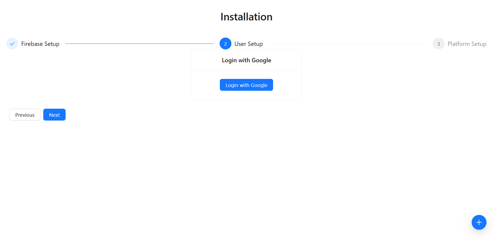
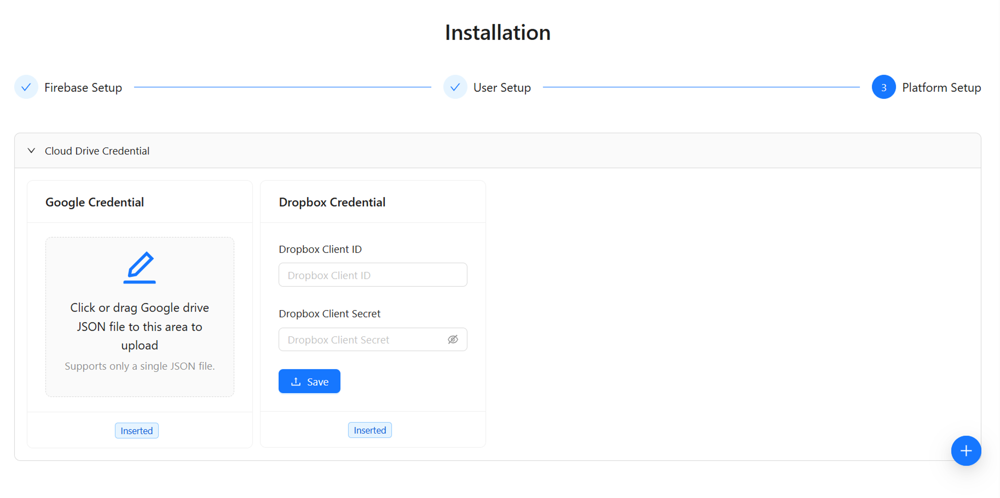
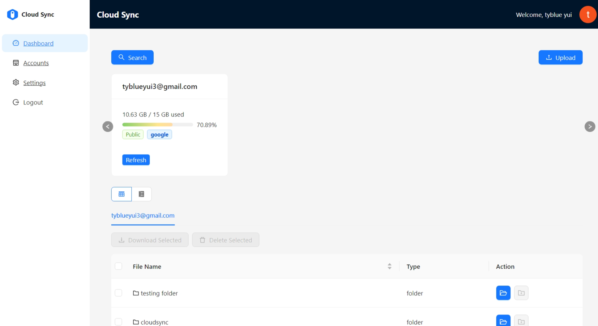
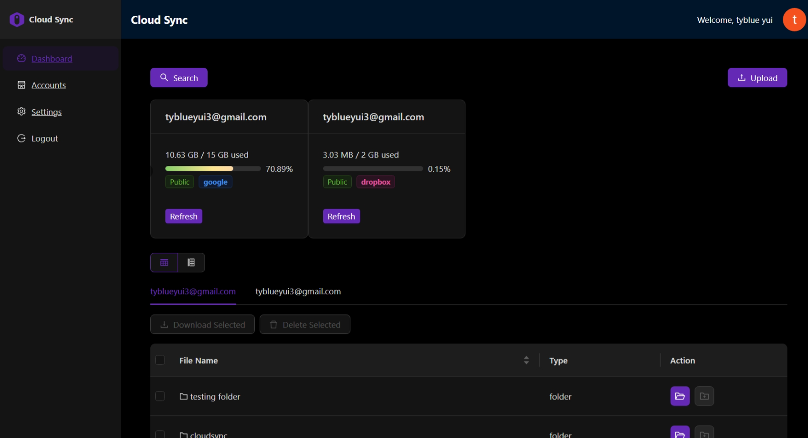
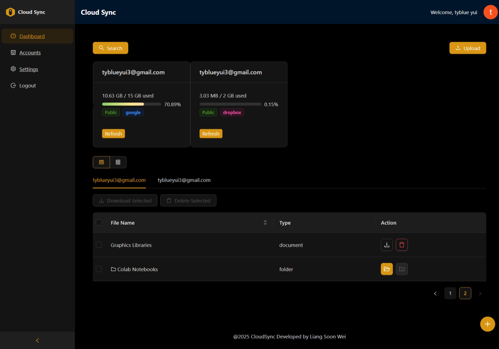
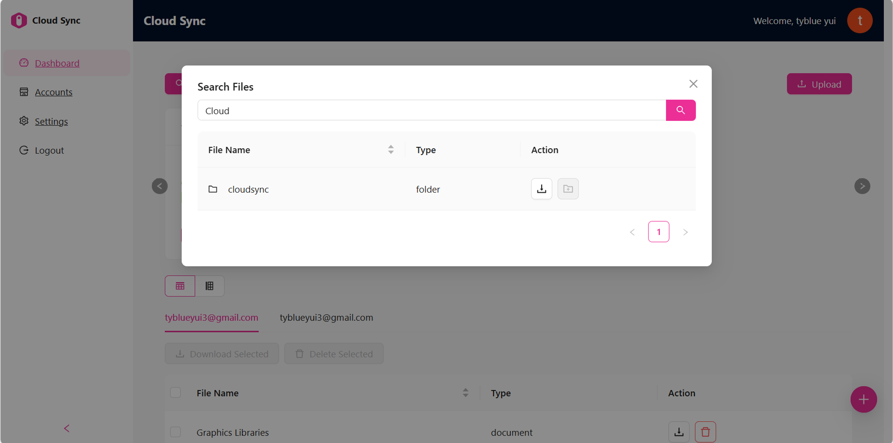
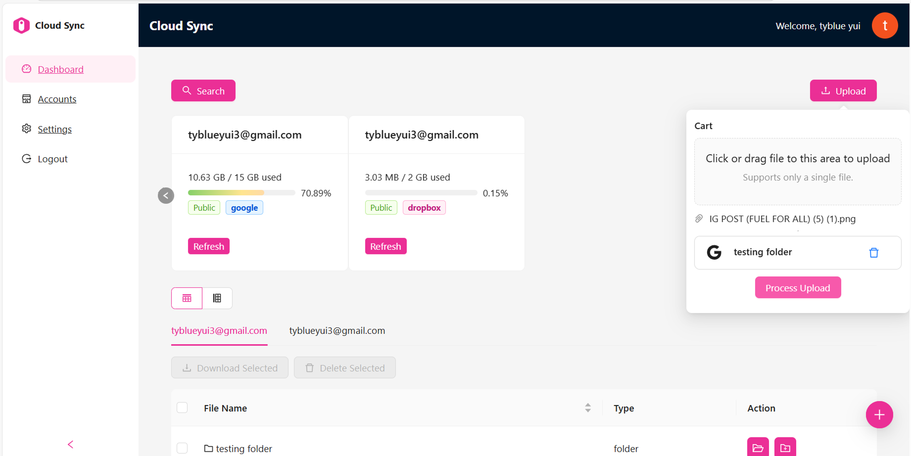
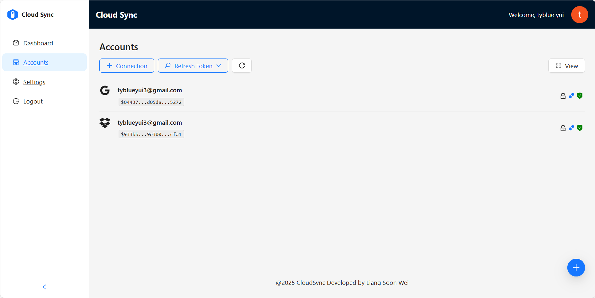
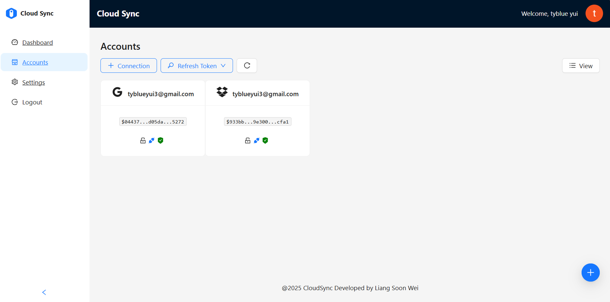
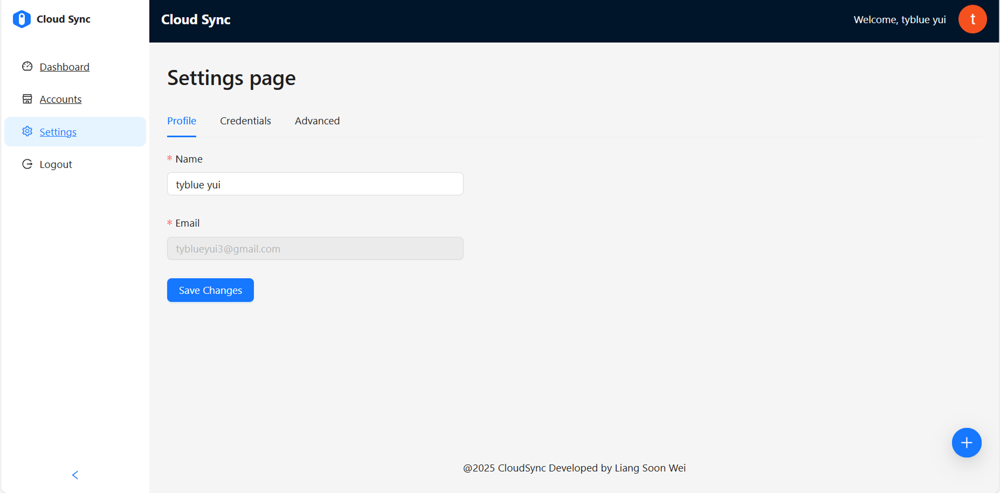

# Cloud Storage Management Platform

This project provides a backend and frontend implementation for connecting and managing cloud storage accounts like Google Drive and Dropbox using OAuth 2.0. Users can authorize their accounts, fetch files and drives, and perform secure integrations with robust token management.

--

## **Technologies Used**

### **Frontend**
- **Refine Framework** with **React**: For the user interface dashboard.
- **Ant Design**: For a user-friendly design system.
- **Axios**: For interacting with backend APIs.


### **Backend**
- **Node.js** with **Express**: For API handling and OAuth 2.0 flow.
- **MongoDB**: For securely storing account and credential data.
- **Axios**: For handling API requests to Google and Dropbox.
- **Encryption/Decryption**: For secure token storage.
- **Backend Respository**: [CloudSync-backend](https://github.com/SwS651/CloudSync-backend)

### **Integration**
- **Google Drive API**: For Google cloud file management and user data access.
- **Dropbox API**: For Dropbox cloud storage integration and file operations.
- **Firebase Authentication**: For secure and scalable user authentication.

## Environment
- Node.js: v20.18.0
- npm: v10.8.1

### Install necessary libraries or dependencies
```bash
    npm install
```

### Running the development server.

```bash
    npm run dev
```

## **Features**

- **OAuth 2.0 Authentication**: Connect and authenticate with Google Drive and Dropbox.
- **Account Management**: Manage multiple accounts for the same or different providers.
- **Secure Token Handling**: Encrypted storage of access and refresh tokens.
- **File and Drive Data Fetching**: Retrieve file and drive metadata for connected accounts.
- **Frontend and Backend Integration**: Seamless connection flow with popups and state management.

---

## Usage
- Authorize Accounts: Use the "Add Account" button to connect Google Drive or Dropbox accounts.
- Manage Accounts: View connected accounts and their associated drives.
- Search Locally: Search files across connected accounts on the frontend.
- File Operations: Upload,fetch, download files

## Project Setup

[See it here](documentation/CloudSync%20Platform%20Project%20Setup.pdf)

## Screenshot
 <br/>



### Dashboard






### Accounts Page



## Settings Page

